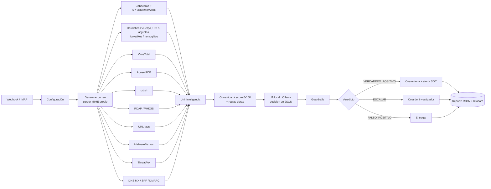

# CENTINELA — Triage de phishing con Inteligencia Artificial (local por defecto)

> Eje temático: **Inteligencia Artificial para la Defensa**
> Hackathon de Ciberdefensa — Ejército Argentino

CENTINELA recibe cada correo que llega a una organización, lo **desarma pieza por pieza**
(remitente, cabeceras, autenticación SPF/DKIM/DMARC, IPs de la cadena de envío, dominios,
enlaces, adjuntos y sus hashes, cuerpo), envía **cada pieza a múltiples fuentes de inteligencia
de amenazas en paralelo**, consolida toda la evidencia y se la entrega a una **IA local** que
decide si el correo es:

| Veredicto | Qué hace CENTINELA |
|---|---|
| `VERDADERO_POSITIVO` | Cuarentena + alerta al SOC con IOCs *defanged* y mapeo MITRE ATT&CK |
| `ESCALAR` | Retiene el correo y abre un caso en la cola del investigador (human-in-the-loop) |
| `FALSO_POSITIVO` | Entrega al usuario y deja traza en bitácora |

El objetivo de la primera versión es **limpiar y filtrar el tráfico malicioso automáticamente**,
liberando a los analistas para que sólo vean lo que realmente requiere criterio humano.

---

## ¿Por qué es relevante?

* El phishing sigue siendo el vector inicial n.º 1 en incidentes contra organismos estatales y
  fuerzas armadas (credenciales robadas → acceso a redes internas, espionaje, ransomware).
* Un SOC militar recibe miles de correos por día; el análisis manual de cabeceras, dominios y
  adjuntos toma 10-20 minutos por correo. CENTINELA lo hace en segundos y **documenta cada decisión**.
* Los filtros comerciales dependen de firmas conocidas. CENTINELA agrega señales que los
  atacantes dirigidos (spear-phishing) no pueden evitar: **antigüedad del dominio, certificados
  recién emitidos, lookalikes del dominio institucional, incoherencia From/Reply-To/Return-Path,
  temática militar desde dominios externos**.
* **Soberanía de datos**: por defecto todo corre en la red propia. El correo nunca sale a una nube de
  terceros; la IA es un modelo open-source ejecutado localmente (Ollama). Sólo se consultan hacia afuera
  hashes, dominios e IPs (nunca el contenido del correo). **Excepción opcional:** con `DEEPSEEK_API_KEY`
  la decisión la toma DeepSeek y la evidencia de cada mensaje sale hacia su API.

---

## Arquitectura



### Las piezas que se analizan

| Pieza | Qué se revisa | Fuentes |
|---|---|---|
| **Remitente** | From vs Reply-To vs Return-Path, display-name spoofing, freemail con nombre institucional, Punycode, suplantación del dominio propio | cabeceras, DNS |
| **Autenticación** | SPF / DKIM / DMARC (resultado y alineación), dominio DKIM ≠ From | cabeceras, DNS (MX, SPF, DMARC publicados) |
| **IPs de la cadena Received** | reputación, Tor, hosting/VPS, país, reportes de abuso | VirusTotal, AbuseIPDB, ThreatFox |
| **Dominios** | detecciones, categoría, antigüedad de registro, primer certificado TLS, subdominios sospechosos, NXDOMAIN | VirusTotal, RDAP, crt.sh, ThreatFox, DNS |
| **URLs** | detecciones, redirecciones, texto ancla engañoso, IP literal, acortadores, TLD abusados, hosting gratuito, `@`, puertos, palabras de captura | VirusTotal, URLhaus, heurísticas |
| **Adjuntos** | hash SHA-256/MD5 contra muestras conocidas, ejecutables, doble extensión, macros, ISO/LNK/HTML smuggling, Unicode RTL, MIME inconsistente | VirusTotal, MalwareBazaar, heurísticas |
| **Cuerpo / HTML** | urgencia, pedido de credenciales, temática financiera/institucional, amenazas, formularios, campos password, scripts, iframes, texto oculto, píxeles | heurísticas |
| **Lookalikes** | distancia de Levenshtein + normalización de homoglifos contra dominios propios y marcas argentinas (ARCA/AFIP, ANSES, Mercado Pago, bancos…) | heurísticas |

### Decisión: IA + guardrails

1. **Motor de reglas** (determinístico, auditable): cada hallazgo tiene severidad y peso; el
   score (0-100) usa rendimientos decrecientes por categoría para que diez palabras clave no
   pesen como un hash de malware. Ciertas evidencias son **reglas duras** (malware conocido,
   IOC confirmado, ejecutable adjunto, campo de contraseña embebido, dominio inexistente).
2. **IA** (Ollama local por defecto, o DeepSeek si se configura `DEEPSEEK_API_KEY`; salida JSON forzada): recibe la evidencia consolidada y devuelve
   veredicto, confianza, tipo de amenaza, resumen para el analista, indicadores clave,
   acciones recomendadas, técnicas MITRE ATT&CK y un mensaje en lenguaje simple para el usuario.
3. **Guardrails** (la IA propone, las reglas tienen veto):
   * regla dura activada → siempre `VERDADERO_POSITIVO`, la IA no puede degradarla;
   * IA dice limpio pero score ≥ 55 → `ESCALAR`;
   * IA dice malicioso con score < 20 y sin reglas duras → `ESCALAR` (no se bloquea sin evidencia);
   * confianza < 0,55 o pocas fuentes disponibles → `ESCALAR`;
   * IA caída → se usa el veredicto del motor de reglas. **El sistema nunca se queda sin respuesta.**

---

## Puesta en marcha (desde cero)

Todo el ecosistema corre en **contenedores separados, con versiones fijas**: flujo n8n, IA local
(Ollama), Agente 1, Agente 2 y dashboard. **No hace falta instalar n8n, Ollama, Python ni Node**:
alcanza con Docker, Git, curl y jq. La guía completa (requisitos por sistema operativo, VPS,
configuración, verificación con evidencia y solución de problemas) está en
**[docs/DESPLIEGUE.md](docs/DESPLIEGUE.md)**.

### 1. Requisitos (sólo si la máquina no los tiene)

| Herramienta | Ubuntu / Debian (VPS) | macOS | Windows 10/11 |
|---|---|---|---|
| Docker Engine + Compose v2 (≥ 2.24) | `curl -fsSL https://get.docker.com \| sudo sh` y `sudo usermod -aG docker "$USER"` (volver a iniciar sesión) | `brew install --cask docker` | `winget install -e --id Docker.DockerDesktop` (WSL 2, reiniciar) |
| Git | `sudo apt-get install -y git` | `brew install git` | `winget install -e --id Git.Git` (incluye Git Bash) |
| curl y jq | `sudo apt-get install -y curl jq` | `brew install jq` | `winget install -e --id jqlang.jq` |

Recursos para contenedores: 6 GB de RAM, 4 CPU y 15 GB de disco con la IA local; 3 GB, 2 CPU y 6 GB
sin ella. Puertos libres: 5678, 11434, 8101, 8102 y 8088 (se cambian en `.env`). En Windows, los comandos
se corren en **Git Bash**.

### 2. Levantar y verificar

```bash
git clone -b branchTest https://github.com/iam-s21-caece/HackatonCiberdefensa.git && cd HackatonCiberdefensa
bash scripts/preparar_maquina.sh     # verifica la máquina y dice qué falta (con --instalar lo instala)
bash scripts/levantar.sh             # .env y secretos, imágenes, contenedores, flujo importado y publicado, salud
bash scripts/verificar_e2e.sh        # corre las muestras: flujo -> Agente 1 -> Agente 2 -> dashboard, con evidencia
```

| Componente | URL | Contenedor |
|---|---|---|
| Dashboard | http://localhost:8088 | `interfaz` (nginx) |
| n8n | http://localhost:5678 (usuario `admin@centinela.local`, contraseña mostrada por `levantar.sh`) | `n8n` (+ `n8n-importar`) |
| Agente 1 · identidad | http://localhost:8101/salud | `agente-identidad` |
| Agente 2 · aprendizaje | http://localhost:8102/api/salud | `agente-aprendizaje` |
| IA local | http://localhost:11434 (no se levanta si decide DeepSeek) | `ollama` (+ `ollama-modelo`) |

El flujo se sube a n8n **por comando**: el servicio `n8n-importar` ejecuta `n8n import:workflow` y
`n8n publish:workflow` antes de que arranque n8n. El paso a paso manual por la UI está en
DESPLIEGUE.md § 4. Sin IA: `bash scripts/levantar.sh --sin-ia`. **IA externa (DeepSeek)**: cargar
`DEEPSEEK_API_KEY` en `.env` (con `IA_PROVEEDOR=auto` se usa sola; la evidencia de cada mensaje sale hacia
api.deepseek.com y la key nunca queda en los reportes). Para eliminar todo:
`bash scripts/eliminar.sh --todo`.

### Analizar un correo

```bash
bash scripts/analizar.sh samples/phishing_credenciales.json      # Linux, macOS o Git Bash
bash scripts/analizar.sh samples/phishing_reembolso.eml
```

```powershell
.\scripts\analizar.ps1 .\samples\legitimo.json                   # PowerShell
```

o con `curl`:

```bash
curl -s -X POST http://localhost:5678/webhook/centinela/analizar \
     -H 'Content-Type: application/json' --data-binary @samples/phishing_credenciales.json | jq .resumen_ejecutivo
```

Entradas aceptadas por el webhook:

* JSON estructurado (`from`, `to`, `subject`, `headers`, `text`, `html`, `attachments[{filename, contentType, sha256 | contentBase64}]`) — es lo que entrega cualquier gateway de correo o API (Graph, Gmail, Postfix milter);
* `{"raw": "<contenido .eml completo>"}` — CENTINELA trae su propio parser MIME (multipart, base64, quoted-printable, RFC 2047, adjuntos y hashes);
* Nodo **IMAP** incluido (desactivado): se le cargan credenciales de una casilla y analiza cada correo no leído automáticamente.

### Multicanal: correo, WhatsApp y SMS

El mismo flujo analiza los tres canales. Cada uno tiene su puerta de entrada y el parser normaliza todo a las mismas piezas (remitente, enlaces, adjuntos, cuerpo), así los 11 analizadores, el puntaje, la IA y los guardrails son los mismos.

| Canal | Webhook | Formatos aceptados |
|---|---|---|
| Correo | `POST /webhook/centinela/analizar` | JSON estructurado, `{"raw": "<.eml>"}`, IMAP |
| WhatsApp | `POST /webhook/centinela/whatsapp` | **Meta WhatsApp Cloud API** (payload de `messages`), **Twilio** (`From=whatsapp:+54…`, `Body`, `NumMedia`), o JSON genérico `{canal, de, para, nombre, texto, fecha, adjuntos[]}` |
| SMS | `POST /webhook/centinela/sms` | **Twilio** (`From`, `To`, `Body`, `MediaUrl0…`), o JSON genérico |

Qué cambia según el canal:

* **Identidad**: en correo se evalúan SPF/DKIM/DMARC y dominios; en WhatsApp/SMS se evalúa el **número** (país E.164 vs. `PAIS_PROPIO`, ID alfanumérico falsificable, código corto, formato no verificable), el **nombre de perfil** que imita una marca o a la institución, y el **grado militar** en el perfil desde un número ajeno. `NUMEROS_PROPIOS` cumple el rol de `DOMINIOS_PROPIOS`.
* **Heurísticas**: se suman los patrones de **smishing** (paquete retenido, tasa aduanera, beneficio ANSES) y de **secuestro de cuenta** ("pasame el código", "cambié de número"); un enlace en un mensaje de un número no registrado pesa más; los dominios sin `http://` (`correo-argentino-envios.click/pago`) se detectan igual.
* **Regla dura** `secuestro_de_cuenta`: pedido de código de verificación + número extranjero / ID alfanumérico / perfil institucional → bloqueo.
* **MITRE**: `T1660 Phishing (Mobile)`, `T1111 MFA Interception`, `T1656 Impersonation` según el caso.

Muestras: `samples/whatsapp_paquete_retenido.json`, `samples/sms_banco_twilio.json` (formato Twilio, remitente alfanumérico), `samples/whatsapp_secuestro_cuenta.json` (formato Meta Cloud API), `samples/whatsapp_legitimo.json`. El script `analizar.ps1` elige la puerta de entrada por el nombre del archivo (`-Canal` para forzarla).

Para conectar un número real: en Meta (WhatsApp Business Platform) o Twilio se configura la URL del webhook apuntando a n8n (con un túnel o IP pública). La verificación `GET hub.challenge` de Meta no está implementada en el prototipo.

### Integración con los agentes (repo del equipo)

* **Agente 1 · identidad del remitente** (`1AgenteModelosObjetivos/`, puerto 8101) está incluido en el flujo como analizador 11 (`Agente 1: identidad del remitente`, código de `integracion_n8n/nodo_agente1.js` + guarda de canal). Recalcula SPF/DKIM/DMARC contra DNS en vez de confiar en la cabecera `Authentication-Results`. Se configura con `AGENTE1_URL`; si no responde, el nodo sale `con_error` y el flujo decide igual. Sólo aplica a correo.
* **Agente 2 · aprendizaje y supervisión** (`2AgenteAprendizaje/`, puerto 8102) e **interfaz** (`interfaz/`, puerto 8088) no tocan el flujo: leen `data/reports/` en solo lectura y proveen la cola del investigador, métricas y calibración de umbrales. Los levanta el mismo `docker-compose.yml`, cada uno en su contenedor.

### Resultados

* `data/reports/<id>.json` — reporte completo (evidencia, hallazgos, respuesta de la IA, IOCs defanged).
* `data/bitacora/VERDADERO_POSITIVO.jsonl`, `ESCALAR.jsonl`, `FALSO_POSITIVO.jsonl` — una línea por decisión (auditable, importable a un SIEM).
* `SOC_WEBHOOK_URL` — si se configura, cada bloqueo/escalado se publica en Slack / Discord / Mattermost / TheHive.

### Probar la lógica sin n8n

```bash
cd workflow
node test_local.js ../samples/phishing_reembolso.eml --ollama http://localhost:11434
```

Ejecuta exactamente el mismo código de los nodos (emula `$input`, `$()` y `this.helpers`).

---

## Estructura del repositorio

```
CENTINELA/
├── docker-compose.yml          ecosistema: un contenedor por componente (n8n, IA, agentes, interfaz)
├── .env.example                versiones, puertos, parámetros y API keys (opcionales)
├── 1AgenteModelosObjetivos/    Agente 1 · identidad del remitente (Python)
├── 2AgenteAprendizaje/         Agente 2 · aprendizaje y supervisión (Python)
├── interfaz/                   dashboard (React + nginx)
├── herramientas/               pruebas de contrato entre agentes y de despliegue
├── evidencias/                 corridas de scripts/verificar_e2e.sh (locales)
├── workflow/
│   ├── centinela_workflow.json  ← importar en n8n (generado)
│   ├── build_workflow.py        arma el JSON a partir de los nodos
│   ├── test_local.js            corre la cadena completa sin n8n
│   └── nodes/                   un archivo .js por nodo Code (legibles y versionables)
│       ├── _common.js           utilidades compartidas
│       ├── 01_desarmar_correo.js
│       ├── 02_cabeceras_auth.js
│       ├── 03_heuristicas.js
│       ├── 04..11_*.js          fuentes de inteligencia
│       ├── 12_consolidar.js     score + prompt de la IA
│       ├── 13_interpretar_ia.js guardrails
│       └── 14..16_accion_*.js   cuarentena / escalar / entregar
├── samples/                     correos y mensajes de prueba (simulados) + esperados.json (hipótesis)
├── scripts/                     preparar_maquina · levantar · analizar · verificar_e2e · eliminar · trazabilidad
├── docs/                        informe, DESPLIEGUE.md, REQUERIMIENTOS.md
└── data/                        reportes y bitácora (generados)
```

Si modificás un nodo: `python workflow/build_workflow.py` y `bash scripts/levantar.sh` (reimporta y publica).

### Notas técnicas (aprendidas a los golpes)

* **n8n 2.x** restringe el nodo *Read/Write Files* a `~/.n8n-files`; el `docker-compose.yml` fija
  `N8N_RESTRICT_FILE_ACCESS_TO=/data` para poder escribir reportes y bitácora.
* El sandbox del *task runner* de n8n **no expone la clase global `URL`** (sí `Buffer`, `require('crypto')`,
  `this.helpers.httpRequest`, `$env`). Por eso `_common.js` trae `parseUrl()` propio.
* Tiempos medidos en CPU (sin GPU): desarmado + 10 fuentes ≈ 5-15 s; IA `llama3.2:3b` ≈ 90-130 s.
  Con GPU NVIDIA (descomentar en el compose) baja a pocos segundos. Si la IA no responde, el motor
  de reglas decide igual (`onError: continue` en el nodo IA).
* Cuotas: VirusTotal free = 4 req/min; por eso cada fuente limita artefactos (`LIM` en `_common.js`).
* Un `.eml` se puede mandar como `{"raw": "..."}`; `scripts/analizar.ps1` lo hace automáticamente.

## Datos utilizados

* **Correos**: simulados (`samples/`), construidos a partir de patrones reales de campañas contra
  organismos argentinos (suplantación institucional, Mercado Pago, haberes, ARCA).
* **Inteligencia de amenazas**: fuentes públicas — VirusTotal, AbuseIPDB, abuse.ch (URLhaus,
  MalwareBazaar, ThreatFox), Certificate Transparency (crt.sh), RDAP (IANA / NIC Argentina),
  DNS público. El hash de la muestra de malware es el archivo de prueba EICAR (inofensivo).
* **IA**: por defecto, modelo open-source (Llama 3.2 / Qwen 2.5) ejecutado localmente, sin datos hacia terceros.
  Opcional: DeepSeek por API (`DEEPSEEK_API_KEY`), en cuyo caso la evidencia de cada mensaje sale de la máquina.

## Roadmap

* Conector directo a Exchange / Microsoft Graph y Postfix (milter) para cuarentena real.
* Detonación de adjuntos en sandbox local (CAPE / Cuckoo) como fuente adicional.
* Panel web de la cola del investigador con retroalimentación (marcar FP/VP) para ajustar pesos.
* Fine-tuning del modelo con las decisiones validadas por los analistas.
* Análisis de imágenes/QR (quishing) con modelo multimodal local.

## Licencia

MIT — hecho para el Hackathon de Ciberdefensa del Ejército Argentino, 2026.
