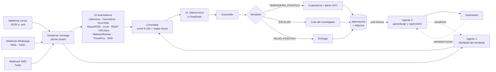

# CENTINELA — Triage de phishing en correo, WhatsApp y SMS con IA y agentes

> **Hackatón de Ciberdefensa · Congreso Cyber.Ar 2026** (Facultad de Ingeniería del Ejército – UNDEF)
> Eje temático: **IA para la defensa de redes e infraestructura**
> Equipo: Pablo Bernal · Elian

---

## Contexto: la temática que abordamos

El phishing es el **vector de entrada número uno** en incidentes contra organismos estatales y fuerzas
armadas. Una credencial robada abre la red interna al espionaje y al ransomware. El ataque ya no llega
sólo por correo:

- **Correo:** suplantación institucional (`ejercito-mil.ar` en lugar de `ejercito.mil.ar`), fraude de
  transferencia (BEC) con autenticación forjada, adjuntos ejecutables disfrazados de PDF.
- **WhatsApp:** secuestro de cuenta ("pasame el código que te llegó") y estafas con perfiles que imitan a
  instituciones o a superiores.
- **SMS:** *smishing* con remitentes alfanuméricos falsificables ("BancoNacion") y enlaces de captura.

Un analista tarda entre 10 y 20 minutos en revisar un mensaje sospechoso a mano (cabeceras, SPF/DKIM/DMARC,
dominios, hashes, registro del dominio), y un SOC recibe miles por día. Los filtros comerciales procesan el
correo en nubes de terceros y dependen de firmas que un atacante dirigido conoce y evita.

**Nuestra propuesta, CENTINELA,** aplica IA a la defensa de la red en tres capas:

1. Un **flujo de triage automático** (n8n) que desarma cada mensaje, lo pasa por 10 analizadores (8 fuentes
   de inteligencia de amenazas y 2 análisis locales) y decide con reglas auditables, IA y guardrails.
2. **Dos agentes inteligentes** diseñados según la taxonomía de Russell y Norvig. Uno verifica en línea
   quién envía realmente cada correo. El otro aprende de los veredictos humanos y supervisa a la IA que
   decide.
3. Un **dashboard del investigador** que recibe todo lo anterior.

Todo corre en contenedores, con versiones fijas, y se levanta y verifica con scripts en cualquier máquina.

---

## Qué hace

Cada mensaje recibe un veredicto, una acción y un reporte con toda su evidencia:

| Veredicto | Acción |
|---|---|
| `VERDADERO_POSITIVO` | Cuarentena y alerta al SOC con IOCs *defanged* y técnicas MITRE ATT&CK |
| `ESCALAR` | Se retiene y se abre un caso en la cola del investigador (*human-in-the-loop*) |
| `FALSO_POSITIVO` | Se entrega al destinatario y queda traza en la bitácora |

## Componentes

| Componente | Qué hace | Tipo de agente (Russell y Norvig) | Cuándo actúa | Carpeta |
|---|---|---|---|---|
| **Flujo n8n** | Recibe por 3 canales, desarma el mensaje, lo pasa por 10 analizadores y el Agente 1, puntúa, decide con IA y guardrails, actúa y guarda el reporte | — | durante | `workflow/` |
| **Agente 1 · identidad del remitente** | Recalcula SPF, DKIM (criptográfico) y DMARC contra DNS en lugar de creerle a la cabecera `Authentication-Results`. Detecta autenticación forjada y el patrón de fraude de transferencia (BEC) | Basado en modelos y objetivos: creencias, acciones con precondiciones, test de objetivo y traza de cada paso | en línea, antes de decidir (sólo correo) | `1AgenteModelosObjetivos/` |
| **Agente 2 · aprendizaje y supervisión** | Percibe los reportes en un ciclo propio. Critica cada decisión con una matriz de costos, propone umbrales (no los aplica), supervisa al decisor IA con meta-alertas, agrupa actores y campañas, ordena la cola y agrega ATT&CK | De aprendizaje: crítico, elemento de aprendizaje, generador de problemas | fuera de banda, después | `2AgenteAprendizaje/` |
| **IA decisora** | Interpreta la evidencia y propone veredicto, resumen y técnicas ATT&CK | — | durante | Ollama local (por defecto) o DeepSeek |
| **Dashboard** | Muestra el estado de los agentes y lo que produce el Agente 2. El veredicto humano vuelve a los dos agentes | — | — | `interfaz/` |

## Arquitectura



Cada componente corre en su propio contenedor (`docker-compose.yml`): `n8n` (más `n8n-importar`, que
importa y publica el flujo), `ollama` (más `ollama-modelo`), `agente-identidad`, `agente-aprendizaje` e
`interfaz`.

### Las piezas que se analizan

| Pieza | Qué se revisa | Fuentes |
|---|---|---|
| **Remitente** | From vs Reply-To vs Return-Path, display-name spoofing, freemail con nombre institucional, Punycode, suplantación del dominio propio; en WhatsApp/SMS, país del número, ID alfanumérico y perfil que imita a una institución | cabeceras, DNS |
| **Autenticación** | SPF / DKIM / DMARC (resultado y alineación), dominio DKIM ≠ From; **recalculados por el Agente 1** | cabeceras, DNS, Agente 1 |
| **IPs de la cadena Received** | reputación, Tor, hosting/VPS, país, reportes de abuso | VirusTotal, AbuseIPDB, ThreatFox |
| **Dominios** | detecciones, categoría, antigüedad de registro, primer certificado TLS, subdominios sospechosos, NXDOMAIN | VirusTotal, RDAP, crt.sh, ThreatFox, DNS |
| **URLs** | detecciones, redirecciones, texto ancla engañoso, IP literal, acortadores, TLD abusados, hosting gratuito, `@`, puertos, palabras de captura | VirusTotal, URLhaus, heurísticas |
| **Adjuntos** | hash SHA-256/MD5 contra muestras conocidas, ejecutables, doble extensión, macros, ISO/LNK/HTML smuggling, Unicode RTL, MIME inconsistente | VirusTotal, MalwareBazaar, heurísticas |
| **Cuerpo / HTML** | urgencia, pedido de credenciales o de códigos de verificación, temática financiera/institucional, amenazas, formularios, campos password, scripts, iframes, texto oculto | heurísticas |
| **Lookalikes** | distancia de Levenshtein + normalización de homoglifos contra dominios propios y marcas argentinas (ARCA/AFIP, ANSES, Mercado Pago, bancos, Correo Argentino…) | heurísticas |

### Decisión: reglas, IA y guardrails

1. **Motor de reglas** (determinístico, auditable). Cada hallazgo tiene severidad y peso. El score
   (0-100) usa rendimientos decrecientes por categoría, para que diez palabras clave no pesen como un hash
   de malware. Umbrales: 0-29 entregar, 30-64 escalar, 65-100 bloquear. Algunas evidencias son **reglas
   duras**: malware conocido, IOC confirmado, ejecutable adjunto, campo de contraseña embebido, dominio
   inexistente, suplantación del dominio propio y secuestro de cuenta.
2. **IA** (Ollama local por defecto; DeepSeek si se configura `DEEPSEEK_API_KEY`). Recibe la evidencia
   consolidada y responde en JSON: veredicto, confianza, tipo de amenaza, resumen para el analista,
   acciones, técnicas MITRE ATT&CK (filtradas contra una lista de técnicas permitidas) y un mensaje simple
   para el usuario.
3. **Guardrails** (la IA propone; las reglas tienen veto):
   * regla dura activada → siempre `VERDADERO_POSITIVO`: la IA no puede degradarla;
   * la IA dice limpio pero el score es ≥ 55 → `ESCALAR`;
   * la IA dice malicioso con score < 20 y sin reglas duras → `ESCALAR` (no se bloquea sin evidencia);
   * confianza < 0,55 o pocas fuentes disponibles → `ESCALAR`;
   * IA caída o sin respuesta válida → decide el motor de reglas.

   **El sistema nunca se queda sin respuesta.** Límite conocido: con score menor a 55 y sin regla dura,
   si la IA dice "limpio", el mensaje se entrega (ver [Límites conocidos](#límites-conocidos)).

---

## Puesta en marcha (desde cero)

**No hace falta instalar n8n, Ollama, Python ni Node:** corren en contenedores. Alcanza con Docker, Git,
curl y jq. La guía detallada (VPS, subida manual del flujo, configuración y solución de problemas) está en
[docs/DESPLIEGUE.md](docs/DESPLIEGUE.md).

### 1. Requisitos (sólo si la máquina no los tiene)

| Herramienta | Ubuntu / Debian | macOS | Windows 10/11 |
|---|---|---|---|
| Docker Engine + Compose v2 (≥ 2.24) | `curl -fsSL https://get.docker.com \| sudo sh` y `sudo usermod -aG docker "$USER"` (volver a iniciar sesión) | `brew install --cask docker` | `winget install -e --id Docker.DockerDesktop` (WSL 2, reiniciar) |
| Git | `sudo apt-get install -y git` | `brew install git` | `winget install -e --id Git.Git` (incluye Git Bash) |
| curl y jq | `sudo apt-get install -y curl jq` | `brew install jq` | `winget install -e --id jqlang.jq` |

- **Recursos con IA local:** 6 GB de RAM, 4 CPU y 15 GB de disco.
- **Recursos sin IA local** (DeepSeek o `--sin-ia`): 3 GB de RAM, 2 CPU y 6 GB de disco.
- **Puertos libres:** 5678, 11434, 8101, 8102 y 8088. Si otro servicio ya los usa (por ejemplo, un n8n
  previo), `preparar_maquina.sh` lo marca como error: hay que detenerlo o cambiar el puerto en `.env`.
- **En Windows:** los comandos se corren en Git Bash.

### 2. Levantar y verificar

```bash
git clone -b branchTest https://github.com/iam-s21-caece/HackatonCiberdefensa.git && cd HackatonCiberdefensa
bash scripts/preparar_maquina.sh     # verifica herramientas, recursos y puertos (con --instalar, instala lo que falta)
cp .env.example .env                 # opcional: API keys de inteligencia y DEEPSEEK_API_KEY
bash scripts/levantar.sh             # secretos, imágenes, contenedores, flujo importado y publicado, salud
bash scripts/verificar_e2e.sh        # 8 muestras: flujo -> Agente 1 -> Agente 2 -> dashboard, con evidencia
```

| Componente | URL | Contenedor |
|---|---|---|
| Dashboard | http://localhost:8088 | `interfaz` (nginx) |
| n8n | http://localhost:5678 (usuario `admin@centinela.local`, contraseña que muestra `levantar.sh` una vez) | `n8n` + `n8n-importar` |
| Agente 1 · identidad | http://localhost:8101/salud | `agente-identidad` |
| Agente 2 · aprendizaje | http://localhost:8102/api/salud | `agente-aprendizaje` |
| IA local | http://localhost:11434 (no se levanta si decide DeepSeek) | `ollama` + `ollama-modelo` |

- **El flujo se sube a n8n por comando.** Antes de que arranque n8n, el servicio `n8n-importar` ejecuta
  `n8n import:workflow` y `n8n publish:workflow`. Los webhooks quedan activos sin tocar la interfaz.
- **IA:** con `DEEPSEEK_API_KEY` en `.env` decide DeepSeek, que `levantar.sh` valida contra su API. Sin
  key decide Ollama local. Con `--sin-ia` decide sólo el motor de reglas.
- **En una VPS:** los puertos quedan en 127.0.0.1. Se accede con un túnel SSH:
  `ssh -N -L 8088:127.0.0.1:8088 -L 5678:127.0.0.1:5678 usuario@IP`.
- **Apagar y borrar:** `docker compose stop` apaga todo; `bash scripts/eliminar.sh --todo` borra todo.

### Analizar un mensaje

```bash
bash scripts/analizar.sh samples/phishing_credenciales.json       # correo (JSON)
bash scripts/analizar.sh samples/phishing_reembolso.eml           # correo (.eml crudo)
bash scripts/analizar.sh samples/whatsapp_secuestro_cuenta.json   # WhatsApp: la puerta sale del nombre del archivo
```

`scripts/analizar.ps1` hace lo mismo desde PowerShell. La salida muestra el veredicto, el score, las
reglas duras, la respuesta de la IA, las técnicas ATT&CK, la conclusión del Agente 1 y cada hallazgo.

Entradas aceptadas:

| Canal | Webhook | Formatos |
|---|---|---|
| Correo | `POST /webhook/centinela/analizar` | JSON estructurado (`from`, `to`, `subject`, `headers`, `text`, `html`, `attachments[]`), `{"raw": "<.eml>"}` (parser MIME propio), o el nodo IMAP incluido (desactivado) |
| WhatsApp | `POST /webhook/centinela/whatsapp` | Meta WhatsApp Cloud API, Twilio (`From=whatsapp:+54…`) o JSON genérico `{canal, de, para, nombre, texto}` |
| SMS | `POST /webhook/centinela/sms` | Twilio (`From`, `To`, `Body`) o JSON genérico |

**Diferencias por canal:**

- **Identidad:** en correo, SPF/DKIM/DMARC y dominios. En WhatsApp y SMS, el número (país E.164 contra
  `PAIS_PROPIO`, ID alfanumérico o código corto) y un nombre de perfil que imite a la institución o a un
  superior.
- **Heurísticas propias de mensajería:** smishing (paquete retenido, tasa aduanera, beneficio ANSES) y
  secuestro de cuenta ("pasame el código", "cambié de número").
- **Regla dura `secuestro_de_cuenta`:** pedido de código de verificación desde un número extranjero, un ID
  alfanumérico o un perfil institucional.
- **MITRE:** `T1660 Phishing (Mobile)`, `T1111 MFA Interception` y `T1656 Impersonation`.

### Resultados

- **`data/reports/<id>.json`:** el reporte completo (evidencia, hallazgos, respuesta de la IA y del
  Agente 1, IOCs *defanged*). Lo leen los dos agentes en solo lectura. **Las API keys no aparecen:** sólo
  figuran como `configurada`.
- **`data/bitacora/{VERDADERO_POSITIVO,ESCALAR,FALSO_POSITIVO}.jsonl`:** una línea por decisión, auditable
  e importable a un SIEM.
- **Dashboard** (`:8088`): estado de los agentes y todo lo que expone el Agente 2 (reportes, cola,
  métricas, calibración, supervisión, actores, ATT&CK y capa Navigator).
- **`SOC_WEBHOOK_URL`:** si se configura, cada bloqueo o escalamiento se publica en Slack, Discord,
  Mattermost o TheHive.

---

## Verificación y trazabilidad

- **De punta a punta, con evidencia:** `bash scripts/verificar_e2e.sh` envía las 8 muestras de `samples/`
  (correo, WhatsApp y SMS; maliciosas y legítimas) con `analizar.sh`. Las contrasta con las hipótesis
  declaradas antes de correr ([`samples/esperados.json`](samples/esperados.json)) y verifica 6 cosas por
  muestra:
  - **C1:** el flujo responde.
  - **C2:** identifica el patrón.
  - **C3:** guarda el reporte sin claves.
  - **C4:** el Agente 1 analiza y deja traza (en mensajería, `NO_APLICA`).
  - **C5:** el Agente 2 percibe el reporte en su **ciclo autónomo**.
  - **C6:** el dashboard lo recibe.

  Registra el entorno exacto (commit, imágenes, modelo y configuración sin secretos) en `evidencias/`.
- **Pruebas automáticas:**
  - Agente 1 y Agente 2, cada uno con su suite.
  - Contratos entre agentes: `herramientas/pruebas_contrato`.
  - Despliegue: `herramientas/pruebas_despliegue`. Contenedores separados, reportes en solo lectura,
    versiones fijas, puertos locales y claves fuera de los reportes.
- **Requerimientos:** cada uno tiene un ID en [docs/REQUERIMIENTOS.md](docs/REQUERIMIENTOS.md), citado en
  el código y en el nombre de sus pruebas. `python scripts/trazabilidad.py` genera la matriz
  [docs/TRAZABILIDAD.md](docs/TRAZABILIDAD.md).

**Verificado** en Windows 11 con Docker Desktop y en una VPS Linux (detalle en DESPLIEGUE.md § 9).

## Límites conocidos

Los declaramos porque son reales en esta versión:

- **Dashboard:** la base funciona y recibe todo lo que expone el Agente 2 (lo comprueba C6), pero las
  vistas de cola, detalle con veredicto, métricas, actores y ATT&CK todavía están **en preparación**.
  Muestran el requerimiento y la respuesta real de su endpoint.
- **Guardrail:** con score menor a 55 y sin regla dura, si la IA dice "limpio", el mensaje se entrega. Una
  inyección de texto en el cuerpo podría aprovecharlo. El Agente 2 lo detecta después: cuando el analista
  confirma que era malicioso, emite la alerta `ia_degrado_un_malicioso` y una recomendación sobre el guardrail.
- **Webhooks sin autenticación.** Mitigado publicando los puertos sólo en 127.0.0.1. El perfil de demo
  (`ORIGENES_CONFIABLES=imap,eml_crudo,json_estructurado`) confía en lo que se sube. En producción, sólo `imap`.
- **Mapeo ATT&CK de base:** asigna `T1056.003` al robo de credenciales, y `T1534` y `T1566.003` al fraude
  BEC por correo. Son asignaciones discutibles que se revisarán.
- **Soberanía con DeepSeek:** con Ollama, el contenido de los mensajes no sale de la máquina. Con
  DeepSeek, la evidencia de cada mensaje (remitente, asunto, cuerpo, URLs) sale hacia su API.
- **Agente 2 en mensajería:**
  - Su réplica del puntaje no incluye la regla `secuestro_de_cuenta`; esos reportes se excluyen de la
    comparación.
  - No usa el número de teléfono como indicador de actor.
- **La IA no es determinística** (temperatura 0,1). La verificación acepta lo que garantizan los
  guardrails e informa aparte cuántas muestras coincidieron con el veredicto ideal.
- **Sin cuarentena física:** el prototipo registra y alerta. Mover el correo requiere el conector al
  gateway de cada organización (Exchange/Graph, Postfix).

---

## Estructura del repositorio

```
HackatonCiberdefensa/
├── docker-compose.yml          un contenedor por componente, versiones fijas, puertos en 127.0.0.1
├── .env.example                versiones, puertos, API keys (opcionales), proveedor de IA, perfil del Agente 1
├── workflow/
│   ├── centinela_workflow.json  flujo que se importa en n8n (generado; centinela.json son copias idénticas)
│   ├── build_workflow.py        arma el JSON a partir de los nodos
│   ├── test_local.js            corre la cadena completa sin n8n
│   └── nodes/                   un archivo .js por nodo Code (01 desarmar … 13 guardrails, 14-16 acciones, 17 Agente 1)
├── 1AgenteModelosObjetivos/    Agente 1 · identidad del remitente (Python, FastAPI) + pruebas
├── 2AgenteAprendizaje/         Agente 2 · aprendizaje y supervisión (Python, FastAPI) + pruebas + experimento
├── interfaz/                   dashboard (React + nginx)
├── samples/                    8 mensajes de prueba (correo, WhatsApp, SMS) + esperados.json (hipótesis)
├── scripts/                    preparar_maquina · levantar · analizar · verificar_e2e · eliminar · trazabilidad
├── herramientas/               pruebas de contrato entre agentes y de despliegue
├── docs/                       DESPLIEGUE.md · REQUERIMIENTOS.md · TRAZABILIDAD.md
├── evidencias/                 corridas de verificar_e2e.sh (locales; se publican con git add -f)
└── data/                       reportes y bitácora del flujo (generados)
```

Si se modifica un nodo: `python workflow/build_workflow.py` y `bash scripts/levantar.sh`, que reimporta y
publica el flujo.

### Notas técnicas

- **n8n 2.x:**
  - Restringe el nodo *Read/Write Files* a `~/.n8n-files`; el compose fija
    `N8N_RESTRICT_FILE_ACCESS_TO=/data`.
  - Reemplazó `update:workflow --active` por `publish:workflow`.
- **Sandbox del task runner de n8n:** no expone la clase global `URL`. Por eso `_common.js` trae
  `parseUrl()` propio.
- **Tiempos en CPU, sin GPU:**
  - Desarmado y 10 fuentes: 5-15 s.
  - IA `llama3.2:3b`: 90-130 s. Con GPU NVIDIA (bloque comentado en el compose) o con DeepSeek, pocos
    segundos.
- **Si la IA no responde:** decide el motor de reglas (`onError: continue`).
- **Cuotas:** VirusTotal gratuito admite 4 consultas por minuto. Por eso cada fuente limita los artefactos
  (`LIM` en `_common.js`).

## Datos utilizados

- **Mensajes:** simulados (`samples/`), a partir de patrones reales de campañas contra organismos
  argentinos: suplantación institucional, Mercado Pago, haberes, paquete retenido, secuestro de cuenta de
  WhatsApp y smishing bancario. El hash de la muestra de malware es el del archivo de prueba EICAR
  (inofensivo).
- **Inteligencia de amenazas:** fuentes públicas. VirusTotal, AbuseIPDB, abuse.ch (URLhaus, MalwareBazaar,
  ThreatFox), Certificate Transparency (crt.sh), RDAP (IANA / NIC Argentina) y DNS público.
- **IA:** por defecto, Llama 3.2 3B (licencia abierta) ejecutado localmente con Ollama. Opcionalmente,
  DeepSeek por API.

## Roadmap

1. Vistas del dashboard: cola del investigador, detalle con registro del veredicto humano, métricas,
   actores y ATT&CK. La API del Agente 2 ya las sirve.
2. Guardrail monótono: la IA no puede rebajar un mensaje por debajo del veredicto de las reglas. Además,
   autenticación en los webhooks.
3. Conector a Microsoft Graph / Exchange y Postfix para cuarentena real.
4. Detonación de adjuntos en sandbox local (CAPE) y análisis de imágenes y QR (*quishing*).
5. Ajuste de umbrales con veredictos reales de los analistas (el Agente 2 los propone desde 40 veredictos).

## Licencia

MIT. Desarrollado para la Hackatón de Ciberdefensa del congreso Cyber.Ar 2026.
